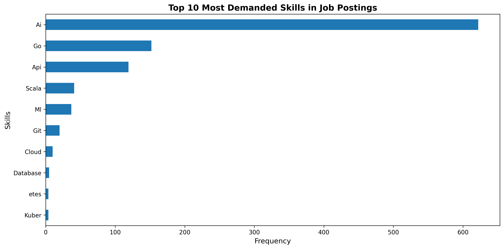
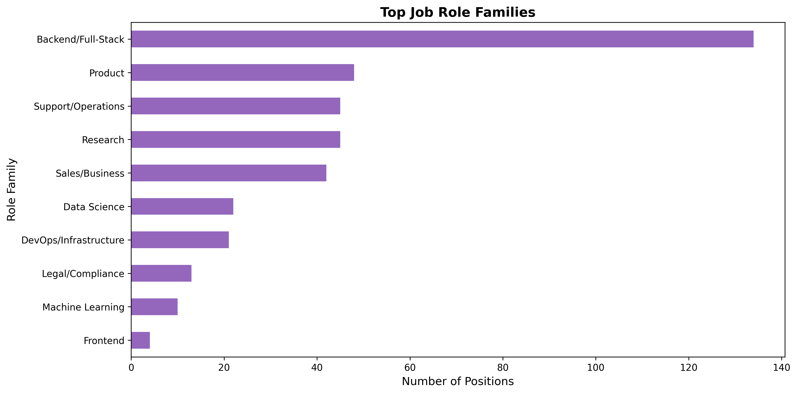
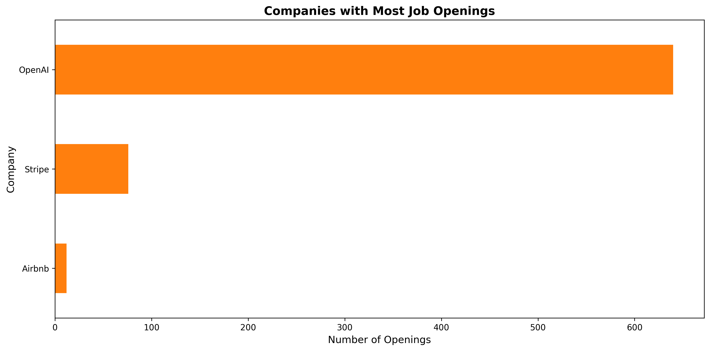
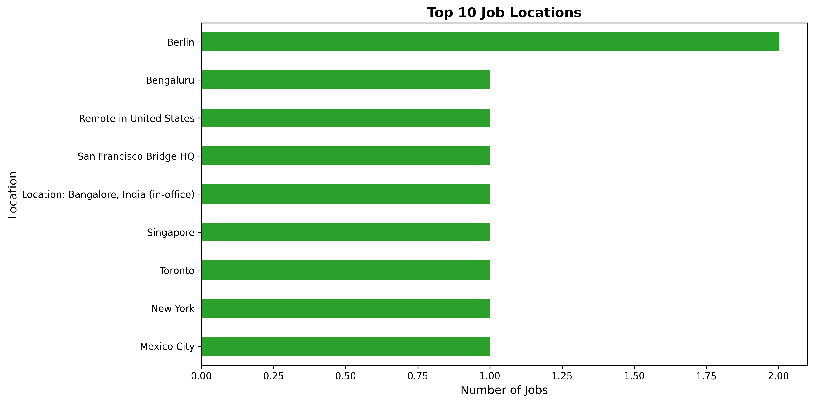
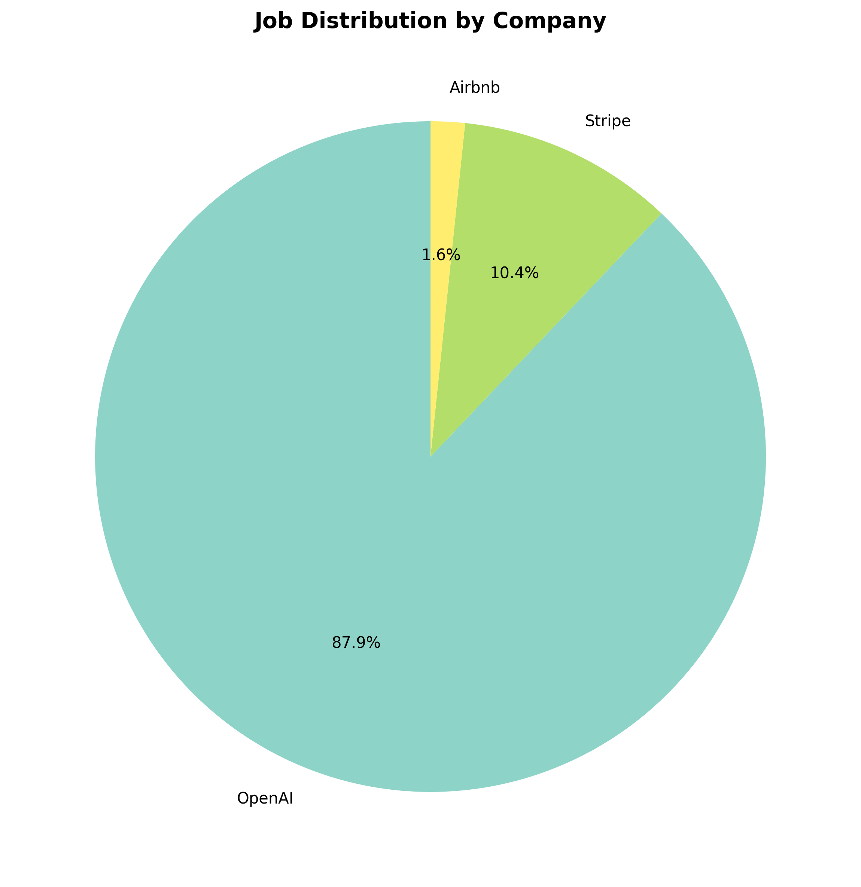
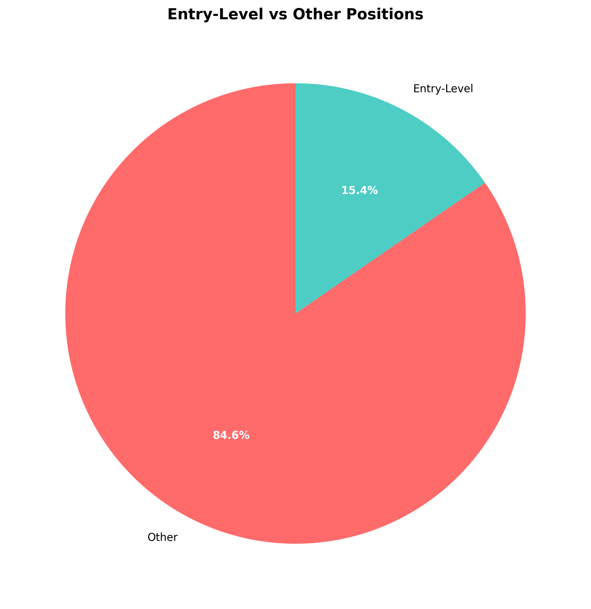

# Visual Analysis Report

This document contains the latest generated visual summaries from the job market pipeline.

## 1) Top Skills

## 2) Role Families

## 3) Top Companies by Openings

## 4) Top Locations

## 5) Company Distribution

## 6) Entry-Level vs Other Roles

## Notes

- Source charts are generated by `analysis/job_insights.py`.
- Images are stored in `docs/` for easier review and sharing.
